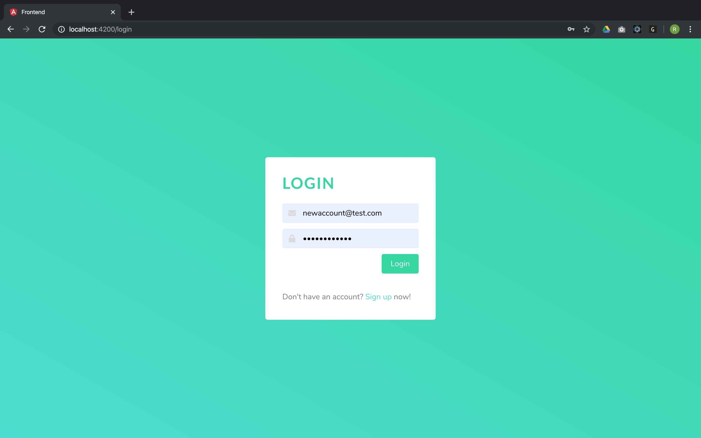
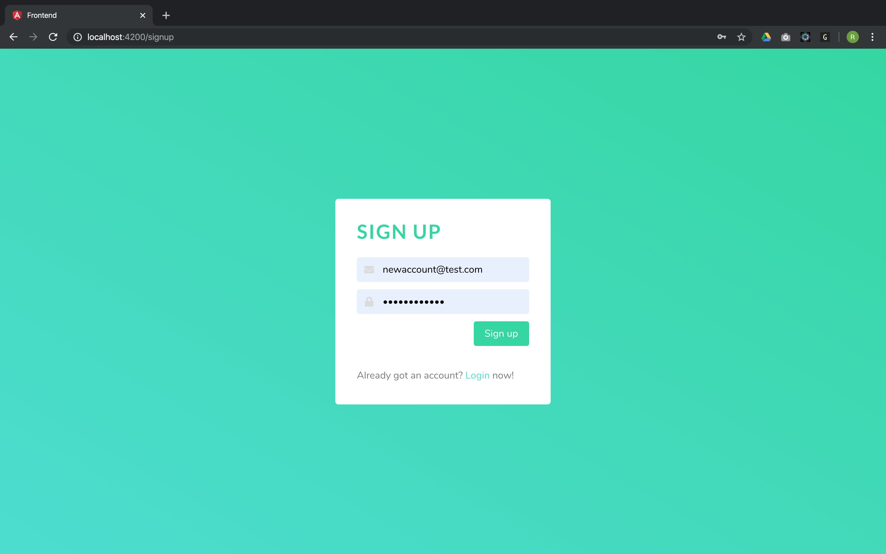
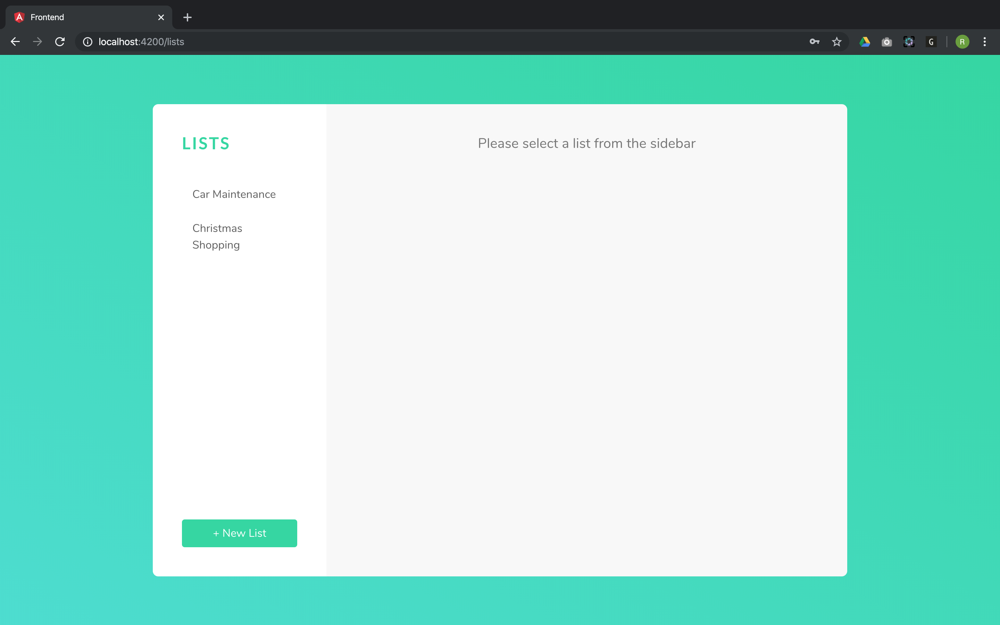
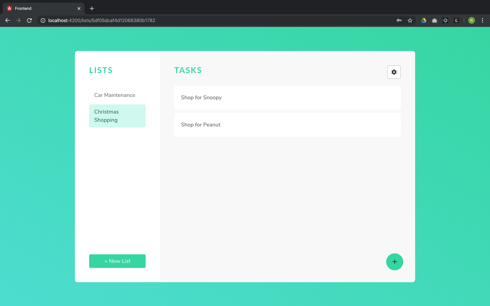
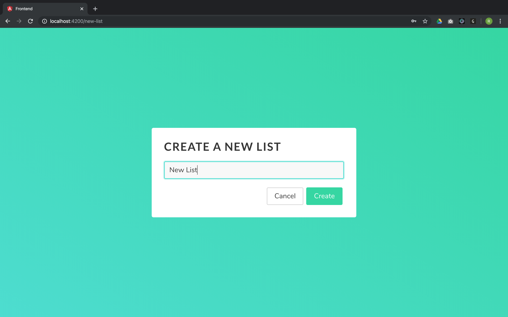
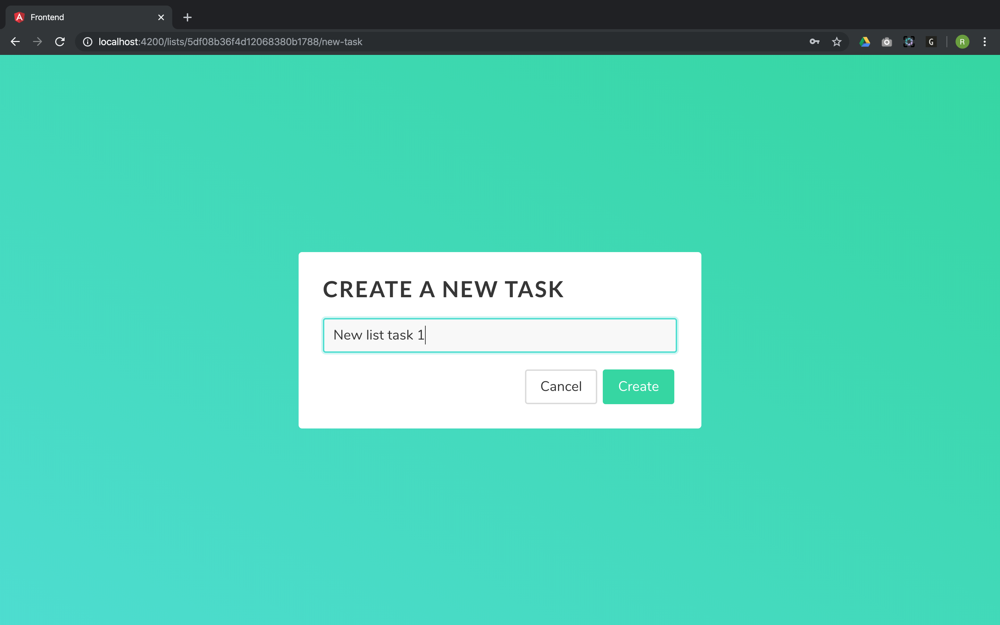
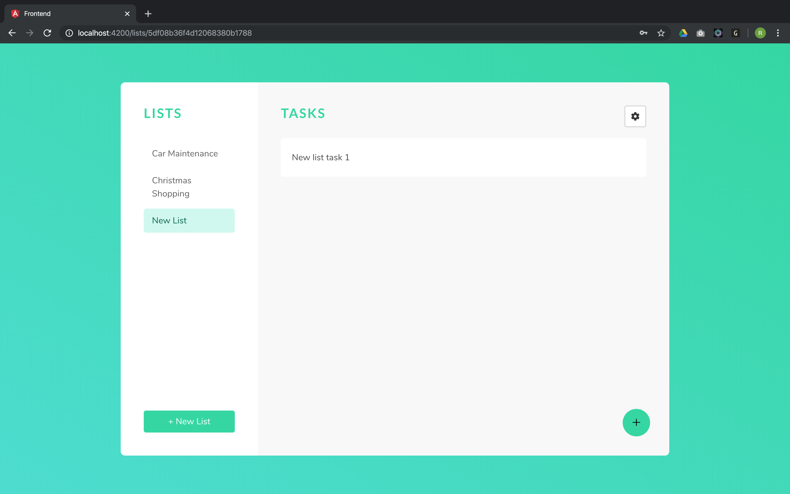
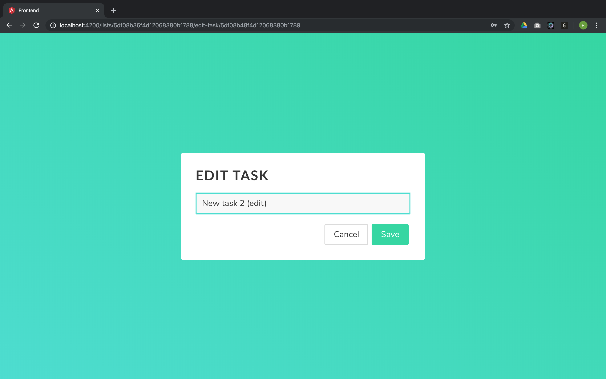

# Task Manager Web Application

### Purpose 
To provide users the ability to create and manage their tasks. The user can create, edit, and delete a list or a task. Login and user authentication provides access to the task manager to the specific user only.

### Features 
- **MongoDB** - Database.  
- **Express** - Back-end web framework.
- **Angular** - Front-end web framework.
- **Node.js** - Back-end web framework.
- **Bulma** - Front-end CSS framework.
- **REST api** - Architecture.
- **JWT** - User authenication.
- **POSTMAN** - Test.

> Run `npm install` in both the **api** and **frontend** folders to install dependencies

